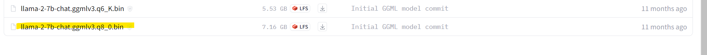

# Process to install and setup in your local machine

## Installation

### Step : 1
Download Model
  https://huggingface.co/TheBloke/Llama-2-7B-Chat-GGML/tree/main



*Model Size will be approx 7 GB, so make sure to download before you start*

### Step : 2
Install Python and Anaconda respective version

### Step : 3
Create a virtual Python environment
```
conda create -p venv python==3.9 -y
```

### Step : 4
Activate the conda environment
```
conda activate venv/
```
For Windows*
```
activate venv/
```

### Step : 5
Create a requirements.txt file in your working directory with the following libraries
```
sentence-transformers
uvicorn
ctransformers
langchain
langchain-community
langchain-core
python-box
streamlit
```

### Step : 6
Install all the libraries from requirements.txt
```
pip install -r requirements.txt
```

### Step : 7
Launching the Application

```
Streamlit run app.py
```

## Feedback

If you have any feedback, please reach out to me at mahabodhitech@gmail.com

